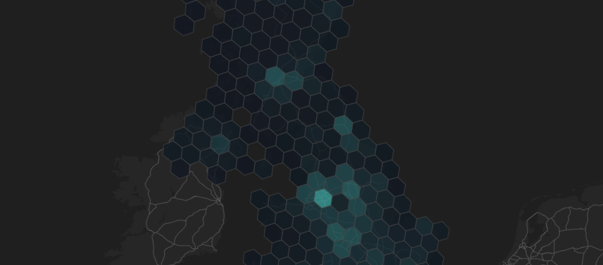

# HERE Interactive Map Layer Examples: Clustering

Interactive Map Layers offer the capability to retrieve statistical information for the data stored in the layer. Both hexagonal and square grid clustering are supported.

The example shows how Interactive Map Layer is used to demonstrate the density of supermarket coverage in the UK. The supermarket retail points are stored in an Interactive Map Layer. The layer is then queried to retrieve the individual points, the density of all supermarkets, and the density of each supermarket chain.

__[Live example](https://heremaps.github.io/here-interactive-map-layer-examples/examples/clustering/index.html)__

## Getting Started

### Clone this repository

    git clone https://github.com/heremaps/here-interactive-map-layer-examples.git

    cd here-interactive-map-layer-examples

### Install dependencies

    yarn install

### Set your API key

Set your [HERE platform API Key](https://developer.here.com/documentation/identity-access-management/dev_guide/topics/plat-using-apikeys.html).

    yarn set-api-key <YOUR_API_KEY>

### Build and launch the examples

To only build the examples, run:

    yarn build

Or alternatively, to build the examples, serve them locally and open them in the browser use the following command:

    yarn start

# License

Copyright (C) 2021-2022 HERE Europe B.V.

This project is licensed under the Apache License, Version 2.0 - see the [LICENSE](LICENSE) file for details