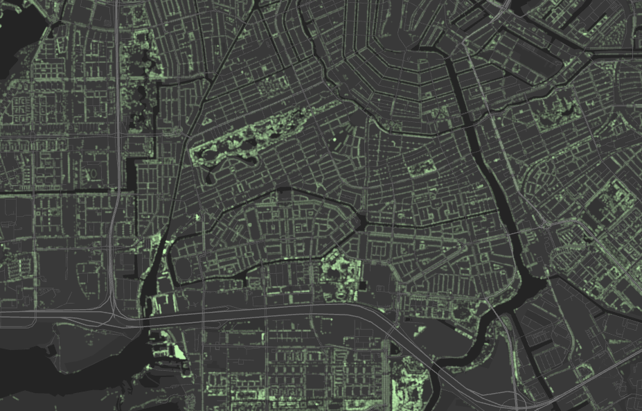

# HERE Interactive Map Layer Examples: Data Sampling

One of the features offered by Interactive Map Layers is data sampling. Data sampling enables clients to efficiently render an excerpt of a very large data set for visual reference and analysis, without the need to retrieve all the data.

This example includes a cadastral map to explore the trees in maintenance of the city of Amsterdam, stored as individual map features. On map zoom levels, where there are too many features, the tiles returned by Interactive API include only a sample with a geographically accurate representation of the data.

__[Live example](https://heremaps.github.io/here-interactive-map-layer-examples/examples/sampling/index.html)__

## Getting Started

### Clone this repository

    git clone https://github.com/heremaps/here-interactive-map-layer-examples.git

    cd here-interactive-map-layer-examples

### Setup HERE public repository
In order to be able to use the [HERE Maps API for Javascript](https://developer.here.com/develop/javascript-api) with NPM the HERE public repository must be added to the NPM configuration:

    yarn config set @here:registry https://repo.platform.here.com/artifactory/api/npm/maps-api-for-javascript/

### Install dependencies

    yarn install

### Set your API key

Set your [HERE platform API Key](https://developer.here.com/documentation/identity-access-management/dev_guide/topics/plat-using-apikeys.html).

    yarn set-api-key <YOUR_API_KEY>

### Build the examples

    yarn build

### Launch the examples

To build the examples, serve them locally and open them in the browser use the following command:

    yarn start

# License

Copyright (C) 2021-2022 HERE Europe B.V.

This project is licensed under the Apache License, Version 2.0 - see the [LICENSE](LICENSE) file for details