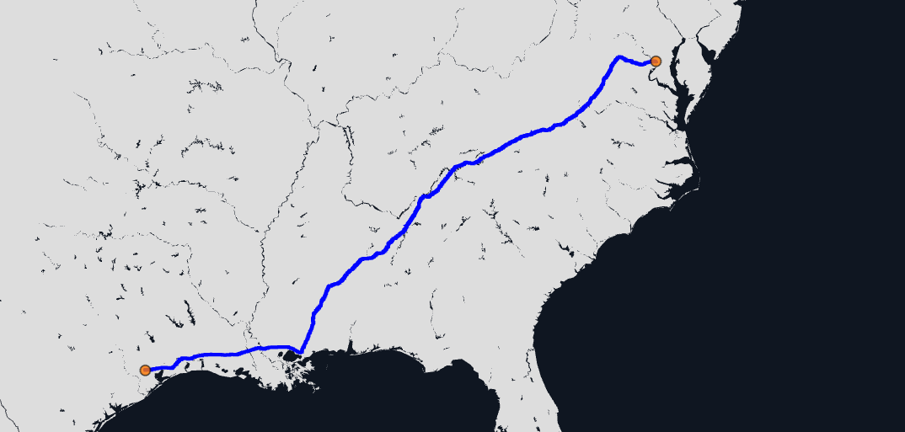

# HERE Interactive Map Layer Examples: Geometry Simplification

Map features stored in interactive map layers can be retrieved as tiles. interactive map layers offer the ability to simplify the geometry of the features in the tiles. This can be useful for reducing the amount of data that needs to be transferred to the client and helps the client to render the data faster.

In this example two very long routes were created using [HERE Routing API](https://developer.here.com/documentation/routing-api/dev_guide/index.html). The tiles returned by Interactive API, contain a simplified version of the route geometry optimized for the zoom level of the map. There is no visual difference between the original and the simplified geometry at the requested zoom level. However, the simplified geometry contains a significantly reduced number of coordinates.

__[Live example](https://heremaps.github.io/here-interactive-map-layer-examples/examples/simplification/index.html)__

## Getting Started

### Clone this repository

    git clone https://github.com/heremaps/here-interactive-map-layer-examples.git

    cd here-interactive-map-layer-examples/examples/simplification

### Install dependencies

    yarn install

### Set your API key

Set your [HERE platform API Key](https://developer.here.com/documentation/identity-access-management/dev_guide/topics/plat-using-apikeys.html).

    yarn set-api-key <YOUR_API_KEY>

### Build and launch the examples

To only build the examples, run:

    yarn build

Or alternatively, to build the examples, serve them locally and open them in the browser use the following command:

    yarn start

# License

Copyright (C) 2021-2022 HERE Europe B.V.

This project is licensed under the Apache License, Version 2.0 - see the [LICENSE](LICENSE) file for details